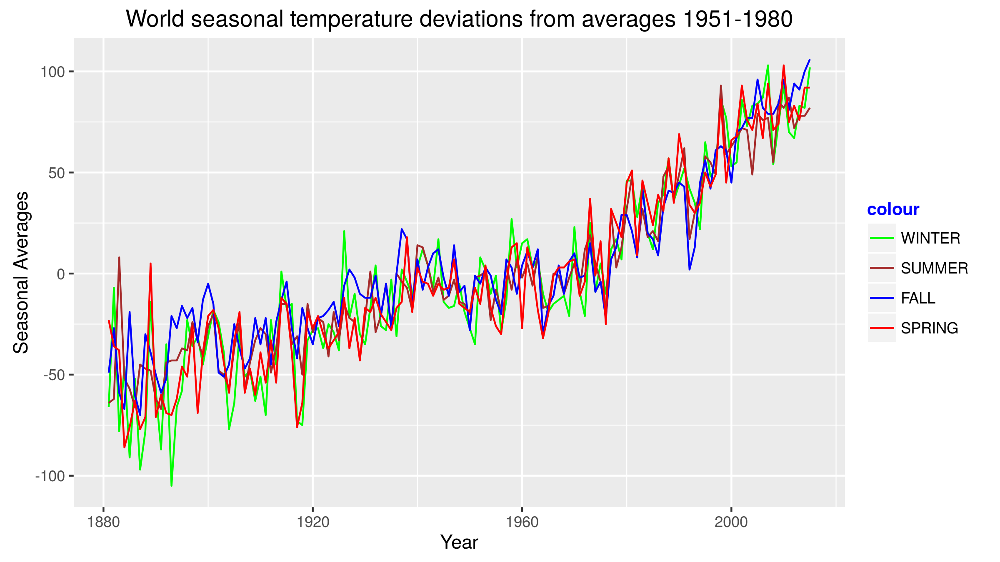

## Motivation

Global warming is a nowadays a concern for almost everybody, that is why I picked this subject. The data used for the application is by NASA GISS Surface Temperature Analysis (GISTEMP).

(http://data.giss.nasa.gov/gistemp/). The values are differences from the means for years 1951-1980 expressed in Farenheit degrees. The Data consists of :

* Individual Months global averages 1881 - 2015 (I removed 1880 and 2016 because incomplete)
* Aggregated seasonal averages (WINTER=DJF, SPRING=MAM, SUMMER=JJA, FALL=SON)
* The dataset also contains two times the year of the observation, I removed one.

---
## Data

The dataset looks like this, the code shows all my manipulations (basically I just remove columns) :


```r
gisTempData <- read.csv("GISTEMPData.csv", header = TRUE)
gisTempData$Year.1 <- NULL
gisTempData$J.D <- NULL
gisTempData$D.N <- NULL
head(gisTempData, 5)
```

```
##   Year Jan Feb Mar Apr  May  Jun Jul Aug Sep Oct Nov  Dec DJF MAM JJA SON
## 1 1881 -79 -64 -37 -28   -5 -113 -54 -26 -37 -51 -59  -16 -66 -23 -64 -49
## 2 1882   9 -14 -10 -60  -38 -103 -71 -13  -9 -33 -41  -68  -7 -36 -62 -27
## 3 1883 -69 -96 -46 -32  -36   43  -2 -18 -47 -59 -71  -40 -78 -38   8 -59
## 4 1884 -62 -37 -41 -96 -121  -84 -86  13 -38 -80 -83 -101 -46 -86 -52 -67
## 5 1885 -92 -79 -91 -87  -49  -93 -61 -16 -15  -3 -39    2 -91 -76 -57 -19
```

---

## Shiny Application

I did not want to apply a model to try to infer how severe the problem is, my application is just a data visualization / exploration application. 

* The application can be found at https://anfe67.shinyapps.io/DevDataProductsProj/
* This presentation can be found at: http://anfe67.github.io/DevDataProductsPres/
* The dataset I use can be found on my github page at https://github.com/anfe67/DevDataProductsProj/
* The Slidify presentation and another copy of the dataset can be found on my github pages at https://github.com/anfe67/DevDataProductsPres/


I selected shades of the same color for the seasons: Blues for Winter, Greens for Spring, Reds for Summer and Browns for Autumn (Fall). Seasons are plotted with dotted lines, while months are continuous. You can select the months and seasons with a group of check boxes (checkboxGroupInput) and the time frame by using a “range” type slider.

---

## Graphs types

The types of plots that you can get from the application look similar to this plot.




